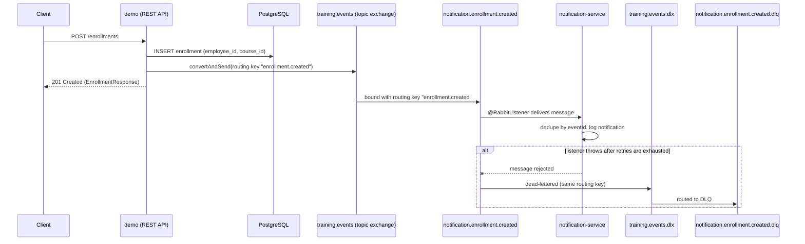

# Training Enrollment System

A small internal system for managing employees, courses, and course enrollments, split into two Spring Boot services that communicate asynchronously over RabbitMQ. The `demo` service exposes the REST API and owns the relational data (employees, courses, enrollments). When an enrollment is created, it publishes an event to a topic exchange. The `notification-service` consumes that event and logs a notification; it has no HTTP API and no database of its own.

## Architecture

- **demo** — Spring Boot + Spring Web MVC + Spring Data JPA + PostgreSQL. Exposes REST endpoints for employees, courses, and enrollments. On enrollment creation, publishes an `EnrollmentCreatedEvent` to RabbitMQ.
- **notification-service** — Spring Boot + Spring AMQP only (no web, no database). Listens for `EnrollmentCreatedEvent` messages and logs a notification line. Deduplicates by event id in memory.

Both services connect to the same RabbitMQ broker and share the same topic exchange name and event schema, but there is no shared code module between them — the event record is duplicated in each project.



## Tech stack

Versions below are the ones pinned in the build files; anything not pinned is resolved by the Spring Boot dependency-management plugin and is left out rather than guessed.

| Component | Version | Where it's pinned |
|---|---|---|
| Java | 21 | `demo/build.gradle.kts` toolchain (`notification-service/build.gradle.kts` has no toolchain block, but requires the same Java version to run Spring Boot 4) |
| Spring Boot | 4.1.1 | both `build.gradle.kts` files |
| Spring Dependency Management plugin | 1.1.7 | both `build.gradle.kts` files |
| Gradle | 9.7.1 | both `gradle/wrapper/gradle-wrapper.properties` |
| PostgreSQL (Docker image) | `postgres:latest` (untagged) | `demo/docker-compose.yml` |
| RabbitMQ (Docker image) | `rabbitmq:3-management` | `demo/docker-compose.yml` |

`demo` dependencies: `spring-boot-starter-webmvc`, `spring-boot-starter-data-jpa`, `spring-boot-starter-validation`, `spring-boot-starter-amqp`, `spring-boot-starter-actuator`, `postgresql` (runtime).

`notification-service` dependencies: `spring-boot-starter-amqp`, `spring-boot-starter-actuator`, `tools.jackson.core:jackson-databind`.

## Prerequisites

- JDK 21
- Docker Desktop (for PostgreSQL and RabbitMQ via Docker Compose)
- `demo/.env` and `notification-service/.env` files (each service imports its own via `spring.config.import=optional:file:.env[.properties]`). These are excluded from version control; create them yourself with:

  `demo/.env`:
  ```
  POSTGRES_DB=<your value>
  POSTGRES_USER=<your value>
  POSTGRES_PASSWORD=<your value>
  RABBITMQ_DEFAULT_USER=<your value>
  RABBITMQ_DEFAULT_PASS=<your value>
  ```

  `notification-service/.env`:
  ```
  RABBITMQ_DEFAULT_USER=<same value as above>
  RABBITMQ_DEFAULT_PASS=<same value as above>
  ```

  RabbitMQ credentials must match between the two files since both services connect to the same broker.

## Local setup (Windows PowerShell)

1. Start PostgreSQL and RabbitMQ (the compose file lives under `demo/`):

   ```powershell
   cd demo
   docker compose up -d
   ```

   This starts PostgreSQL on `localhost:5432` and RabbitMQ on `localhost:5672`, with the RabbitMQ management UI on `http://localhost:15672` (login with the `RABBITMQ_DEFAULT_USER` / `RABBITMQ_DEFAULT_PASS` from your `.env`).

2. Run the `demo` service (REST API, port `8080` by default):

   ```powershell
   cd demo
   .\gradlew.bat bootRun
   ```

3. In a separate terminal, run `notification-service`:

   ```powershell
   cd notification-service
   .\gradlew.bat bootRun
   ```

4. Create an employee and a course, then enroll:

   ```powershell
   curl -X POST http://localhost:8080/employees -H "Content-Type: application/json" -d '{"firstName":"Ana","lastName":"Pop","email":"ana@corp.com","department":"Eng"}'
   curl -X POST http://localhost:8080/courses -H "Content-Type: application/json" -d '{"title":"Java","description":"Intro to Java","duration":40}'
   curl -X POST http://localhost:8080/enrollments -H "Content-Type: application/json" -d '{"employeeId":1,"courseId":1}'
   ```

   The `notification-service` console should log a line for the enrollment once the message is delivered.

## API reference

All endpoints are on `demo`. `notification-service` exposes no HTTP API.

### Employees (`/employees`)

| Method | Path | Request body | Response body | Status codes |
|---|---|---|---|---|
| GET | `/employees` | none (query params: `email`, `department`, `lastName`, plus `page`, `size`, `sort`) | `PageResponse<EmployeeResponse>` | 200 |
| GET | `/employees/{id}` | none | `EmployeeResponse` | 200, 404 |
| POST | `/employees` | `EmployeeRequest` | `EmployeeResponse` | 201, 400, 409 |

### Courses (`/courses`)

| Method | Path | Request body | Response body | Status codes |
|---|---|---|---|---|
| GET | `/courses` | none (query params: `title`, `minDuration`, `maxDuration`, plus `page`, `size`, `sort`) | `PageResponse<CourseResponse>` | 200 |
| GET | `/courses/{id}` | none | `CourseResponse` | 200, 404 |
| POST | `/courses` | `CourseRequest` | `CourseResponse` | 200, 400 |

### Enrollments (`/enrollments`)

| Method | Path | Request body | Response body | Status codes |
|---|---|---|---|---|
| GET | `/enrollments` | none (optional query param `employeeId`) | `List<EnrollmentResponse>` | 200, 404 (if `employeeId` doesn't exist) |
| GET | `/enrollments/{id}` | none | `EnrollmentResponse` | 200, 404 |
| POST | `/enrollments` | `EnrollmentRequest` | `EnrollmentResponse` | 201, 400, 404, 409 |
| PATCH | `/enrollments/{id}/status` | `StatusUpdateRequest` | `EnrollmentResponse` | 200, 400, 404 |

Note: `POST /courses` returns `200`, not `201` — it has no `@ResponseStatus` annotation, unlike `POST /employees` and `POST /enrollments`, which are explicitly annotated `@ResponseStatus(HttpStatus.CREATED)`.

### Request/response shapes

```json
// EmployeeRequest
{ "firstName": "string", "lastName": "string", "email": "string (must be a valid email)", "department": "string" }

// EmployeeResponse
{ "id": 1, "firstName": "string", "lastName": "string", "email": "string", "department": "string" }

// CourseRequest
{ "title": "string", "description": "string", "duration": 40 }

// CourseResponse
{ "id": 1, "title": "string", "description": "string", "duration": 40 }

// EnrollmentRequest
{ "employeeId": 1, "courseId": 1 }

// EnrollmentResponse
{ "id": 1, "employeeId": 1, "courseId": 1, "status": "ENROLLED", "employeeEmail": "string" }

// StatusUpdateRequest
{ "status": "ENROLLED | COMPLETED | CANCELLED" }

// PageResponse<T>
{ "content": [/* T */], "pageNumber": 0, "pageSize": 20, "totalElements": 0, "totalPages": 0, "last": true }
```

Every error response (400, 404, 409, 500) is an RFC 9457 `ProblemDetail` body, e.g.:

```json
{
  "type": "about:blank",
  "title": "Resource Not Found",
  "status": 404,
  "detail": "employee with id '99' not found",
  "timestamp": "2026-09-20T12:00:00Z"
}
```

## Messaging design

- **Exchange**: `training.events`, a durable `TopicExchange`, declared in `demo`'s `RabbitConfig`.
- **Routing key**: `enrollment.created`, used both for publishing and for the queue binding.
- **Queue**: `notification.enrollment.created`, a durable queue declared and bound by `notification-service` (the publisher only declares the exchange — it does not declare or bind the consumer's queue).
- **Dead-letter exchange**: `training.events.dlx`, a `DirectExchange`.
- **Dead-letter queue**: `notification.enrollment.created.dlq`, bound to the DLX with the same routing key (`enrollment.created`).
- **Retry**: configured in `notification-service`'s `application.properties` via `spring.rabbitmq.listener.simple.retry`: enabled, initial interval `1000ms`, multiplier `2`, max `3` retries, max interval `10000ms`. Once retries are exhausted, the message is rejected and routed to the dead-letter queue via the queue's `deadLetterExchange`/`deadLetterRoutingKey` configuration.

## Design decisions

- **DTOs separate the API contract from entities.** Controllers only ever see `*Request`/`*Response` records, never JPA entities directly, so persistence changes don't leak into the API shape.
- **Centralised exception handling.** `GlobalExceptionHandler` (`@RestControllerAdvice`) maps domain exceptions to RFC 9457 `ProblemDetail` responses with the right HTTP status. Unexpected exceptions get a generated `errorId` (a random UUID) logged server-side and returned to the client, so a user can report an error without exposing internals.
- **Two-layer uniqueness enforcement.** Both `Employee.email` (`@Column(unique = true)`) and `Enrollment(employee_id, course_id)` (`@UniqueConstraint`) are enforced at the database level, and both services also check first (`findByEmail`, `existsByEmployeeIdAndCourseId`) to fail fast with a clear domain exception. The service-level check alone is not safe under concurrent requests (two requests can both pass the check before either inserts); the database constraint is what actually guarantees correctness, and `GlobalExceptionHandler` maps the resulting `DataIntegrityViolationException` to `409 Conflict` as a fallback.
- **Avoiding N+1 with `@EntityGraph`.** `EnrollmentRepository.findAll()` is overridden with `@EntityGraph(attributePaths = {"employee", "course"})` so that mapping each `Enrollment` to its response DTO (which reads `employee.email` and `course.title`) doesn't trigger a separate lazy-load query per row.
- **Dynamic filtering with Specifications.** `CourseSpecifications` and `EmployeeSpecifications` build `Specification` predicates per filter field (title prefix, duration range, email, department, last name), combined with `Specification.allOf(...)` in the service layer, so optional filters don't require a combinatorial number of repository methods.
- **Event publisher interface owned by the service layer.** `EnrollmentService` depends on `EnrollmentEventPublisher`, an interface in the `service.publisher` package. `RabbitEnrollmentEventPublisher`, the RabbitMQ-specific implementation, lives in `messaging.rabbit` and depends inward on that interface — the service layer has no compile-time dependency on RabbitMQ.
- **Idempotent consumer.** RabbitMQ's `simple` listener container gives at-least-once delivery, not exactly-once: a message can be redelivered after a retry, a broker restart, or an ack that fails to reach the broker. `EnrollmentEventListener` deduplicates by `eventId` before processing, so a redelivered message doesn't produce a duplicate notification.

## Known limitations

- **In-memory deduplication doesn't survive restarts or scale-out.** `EnrollmentEventListener` tracks processed event ids in a `ConcurrentHashMap`-backed set held in process memory. A restart clears it, and running more than one instance of `notification-service` means each instance has its own set, so a redelivery to a different instance would not be caught. A persistent dedup store (a database table with a unique constraint on `eventId`, or a shared cache) would be needed for correctness at scale.
- **Dual write between the database and the message broker.** `EnrollmentService.createEnrollment` saves the enrollment and then publishes the event as two separate operations, not atomically. If the process crashes after the commit but before the publish, the event is lost; if the broker call fails, the enrollment still exists with no notification ever sent. The standard fix is the transactional outbox pattern: write the event to an outbox table in the same database transaction as the business change, and have a separate process relay outbox rows to RabbitMQ.
- **`ddl-auto=update` is not suitable for production.** `demo` uses `spring.jpa.hibernate.ddl-auto=update`, which lets Hibernate infer schema changes from the entity model. This is convenient for local development but is not a reliable or reviewable way to manage schema changes in production. A migration tool such as Flyway or Liquibase, with versioned, reviewable migration scripts, is the standard alternative.
